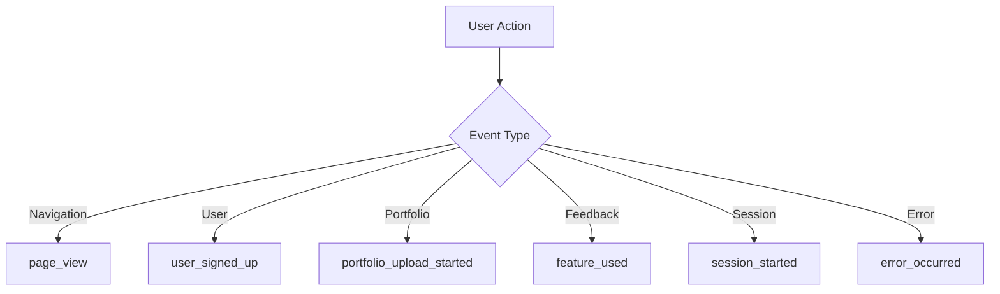

# Tales - Tracking Plan

## Overview
This document describes all events tracked in the Tales application, including their placement, properties, and purpose.

## Navigation Events

### `page_view`
**Description**: Event triggered when a page is viewed
**Placement**: Across all application pages
**Properties**:
- `page_name`: Page name (e.g., 'home', 'dashboard', 'feedback')
- `referrer`: URL of the previous page (optional)

## User Events

### `user_signed_up`
**Description**: Event triggered when a user registers
**Placement**: After successful registration
**Properties**:
- `method`: Registration method ('email' | 'google' | 'github')

### `user_logged_in`
**Description**: Event triggered when a user logs in
**Placement**: After successful login
**Properties**:
- `method`: Login method ('email' | 'google' | 'github')

### `user_logged_out`
**Description**: Event triggered when a user logs out
**Placement**: After logout

## Portfolio Events

### `portfolio_upload_started`
**Description**: Event triggered when a user starts uploading a portfolio
**Placement**: 
- When selecting a file
- When dragging and dropping a file
- When entering a link
**Properties**:
- `type`: Upload type ('file' | 'link')
- `file_type`: File type (only for file upload)
- `file_size`: File size in bytes (only for file upload)

### `portfolio_upload_completed`
**Description**: Event triggered when upload is successfully completed
**Placement**: After successful upload processing
**Properties**:
- `type`: Upload type ('file' | 'link')
- `file_type`: File type (only for file upload)
- `file_size`: File size in bytes (only for file upload)

### `portfolio_upload_failed`
**Description**: Event triggered when upload fails
**Placement**: After upload failure
**Properties**:
- `type`: Upload type ('file' | 'link')
- `error`: Detailed error message

## Feedback Events

### `feature_used`
**Description**: Generic event for tracking feature interactions
**Placement**: Across various application components

#### Feature Used Subtypes:

1. **Home Page CTAs**
   - `feature_name`: 'home_cta'
   - `action`: 
     - 'clicked_browse_files'
     - 'clicked_solution'
     - 'clicked_get_started'
     - 'clicked_submit_review'
   - `cta_type`: 'button'

2. **Feedback List**
   - `feature_name`: 'feedback_list'
   - `action`:
     - 'selected_feedback'
     - 'deleted_feedback'
   - `feedback_id`: Feedback ID
   - `feedback_status`: Feedback status
   - `cta_type`: 'button'

3. **Feedback Entry**
   - `feature_name`:
     - 'reference_interaction'
     - 'feedback_export'
     - 'feedback_action'
   - `action`:
     - 'clicked_{type}' (for references)
     - 'downloaded_pdf'
     - 'requested_consultation'
   - `reference_title`: Reference title (only for reference interactions)
   - `cta_type`: 'button' | 'link'

4. **Peel Component**
   - `feature_name`: 'peel_interaction'
   - `action`:
     - 'started_peeling'
     - 'completed_peeling'
     - 'cancelled_peeling'
   - `cta_type`: 'button'

## Session Events

### `session_started`
**Description**: Event triggered at the start of a session
**Placement**: When user accesses the application

### `session_ended`
**Description**: Event triggered at the end of a session
**Placement**: When user leaves the application
**Properties**:
- `duration`: Session duration in seconds

## Error Events

### `error_occurred`
**Description**: Event triggered when an error occurs
**Placement**: Across various points in the application
**Properties**:
- `error_type`: Error type
- `error_message`: Detailed error message
- `page`: Page where error occurred

## Key Metrics to Analyze

1. **Engagement**
   - Upload conversion rate
   - Average time on page
   - User retention rate

2. **CTA Performance**
   - Click-through rate by CTA type
   - Conversion rate by CTA type
   - Feature usage frequency

3. **Feedback Quality**
   - Processing success rate
   - Average processing time
   - PDF download rate

4. **User Behavior**
   - Navigation patterns
   - Reference usage frequency
   - Consultation request rate

## Implementation

To implement tracking:

1. Configure environment variables:
```env
NEXT_PUBLIC_POSTHOG_KEY=your_posthog_project_api_key
NEXT_PUBLIC_POSTHOG_HOST=https://app.posthog.com
```

2. Verify functionality:
   - Open browser console
   - Check if events are being sent
   - Confirm in PostHog dashboard

## Maintenance

The tracking plan should be updated when:
- New features are added
- CTAs are modified
- New event types are needed

## Event Flow Diagram



## Best Practices

1. **Event Naming**
   - Use past tense for events
   - Be consistent with naming conventions
   - Use descriptive names

2. **Property Usage**
   - Include relevant context
   - Avoid sensitive information
   - Use consistent data types

3. **Testing**
   - Verify events in development
   - Test all user flows
   - Monitor event volume

4. **Documentation**
   - Keep tracking plan updated
   - Document new events
   - Maintain change log
```

This document serves as a reference for the product and analytics team, ensuring all important events are being tracked and can be properly analyzed. 